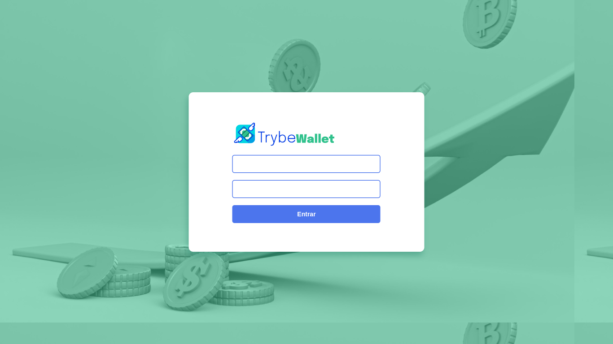
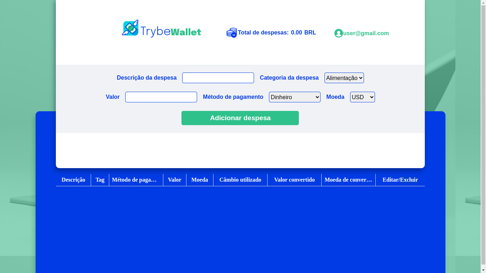

<h1 align="center">TrybeWallet</h1>

<p align="center">
  
</p>

<p align="center">Com muita satisfação, apresento o resultado do projeto de Frontend da Trybe, intitulado "TrybeWallet". Neste projeto, desenvolvi uma aplicação de carteira de gastos, que permite gerenciar finanças em diversas moedas, utilizando as tecnologias React e Redux.</p>

<p align="center">
  <a href="https://front-end-wallet-three.vercel.app/">Ver Demo</a>
  ·
  <a href="https://github.com/ElieltonRamos/FrontEnd-Wallet-ts">Repositório</a>
</p>

## Índice

- [Sobre o Projeto](#sobre-o-projeto)
- [Tecnologias Utilizadas](#tecnologias-utilizadas)
- [Funcionalidades](#funcionalidades)
- [Capturas de Tela](#capturas-de-tela)
- [Instalação e Uso](#instalação-e-uso)
- [Testes](#testes)
- [Autor](#autor)
- [Agradecimentos](#agradecimentos)
- [Licença](#licença)

## Sobre o Projeto

Ao longo do desenvolvimento, aprimorei minhas habilidades em criação de stores Redux, reducers, actions e dispatchers em aplicações React, além de aprender a manipular e ler o estado global usando os hooks do React/Redux. Também explorei a manipulação de Actions assíncronas e requisições a uma API, o que enriqueceu ainda mais meu conhecimento.

Para estilização, utilizei CSS Modules, garantindo uma organização eficiente do código e facilitando a manutenção do projeto. Além disso, implementei testes rigorosos, alcançando uma cobertura de mais de 99% com a combinação do React Testing Library e Jest.

## Tecnologias Utilizadas

- [React](https://reactjs.org)
- [Redux](https://redux.js.org)
- [CSS Modules](https://github.com/css-modules/css-modules)

## Funcionalidades

Página de Login: Criei uma página inicial de login que permite que os usuários se identifiquem com e-mail e senha.

Página da Carteira: Desenvolvi uma página para gerenciamento da carteira de gastos. A página exibe a despesa total em reais (BRL) e conta com um header informativo.

Formulário de Adição de Despesa: Criei um formulário que permite adicionar despesas à carteira. Ao clicar no botão "Adicionar despesa", as informações são salvas no estado global.

Tabela de Gastos: Implementei uma tabela de gastos que é alimentada pelo estado da aplicação, exibindo as despesas em formato de lista.

Botão de Deletar Despesa: Adicionei um botão na tabela de gastos que permite a remoção de uma despesa. Ao clicar no botão, a despesa é deletada do estado global e da tabela, e o valor total exibido no header é atualizado.

Botão de Editar Despesa: Implementei um botão na tabela de gastos que habilita um formulário de edição para cada despesa. Ao clicar em "Editar despesa", as informações são atualizadas no estado global.

Cobertura de Testes: Desenvolvi testes para garantir a funcionalidade correta da aplicação, alcançando mais de 95% de cobertura total.

## Capturas de Tela




## Instalação e Uso

Siga os passos abaixo para rodar o projeto localmente:

1. Clone o repositório:

```
 git clone git@github.com:ElieltonRamos/Front-end-Web-Wallet.git
```
2. Navegue para o diretório do projeto:
```
cd Front-end-Web-Wallet
```
3. Instale as dependências:
```
npm install
```
4. Abra um servidor local com vite
```
npm run dev
```

## Testes
Durante o desenvolvimento do projeto TrybeWallet, priorizei a qualidade do código e a robustez da aplicação por meio da implementação de testes automatizados. Utilizei as seguintes ferramentas e abordagens para garantir a confiabilidade da aplicação:

React Testing Library: Optei por utilizar o React Testing Library para testar os componentes React. Essa biblioteca proporciona uma abordagem mais centrada no comportamento do usuário, simulando as interações do usuário com a interface e verificando o comportamento esperado dos componentes.

Jest: O Jest é um framework de testes amplamente utilizado com o React Testing Library. Ele me permitiu escrever asserções claras e concisas para verificar o funcionamento correto dos componentes e das funcionalidades.

Para executar os testes execute no terminal

```
npm test
```

## Autor

Elielton Ramos

## Agradecimentos

Sou grato à Trybe por proporcionar esse desafio enriquecedor e pela oportunidade de aprimorar minhas habilidades como desenvolvedor. Estou empolgado para aplicar os conhecimentos adquiridos em projetos futuros e continuar minha jornada de evolução profissional.

## Licença
Código Aberto (Open Source)

Este projeto é de código aberto e está disponível para toda a comunidade. Fique à vontade para explorar, clonar e contribuir para o projeto.
